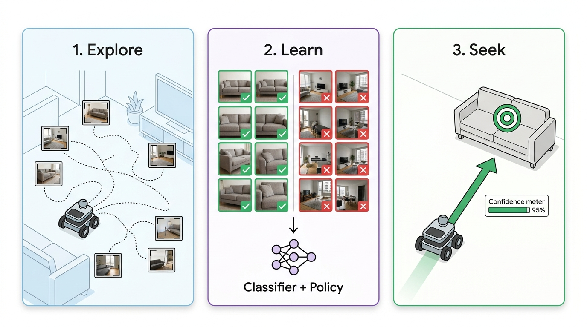
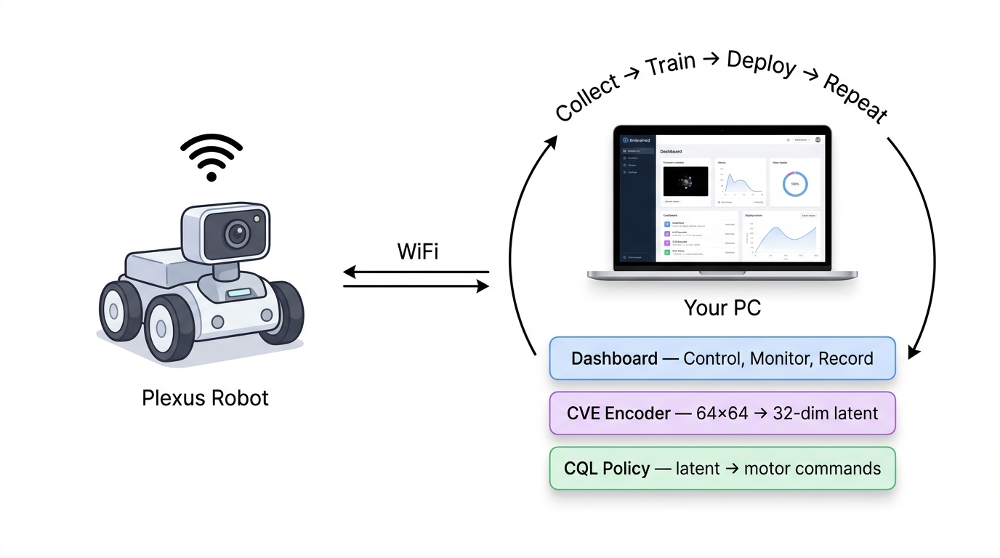
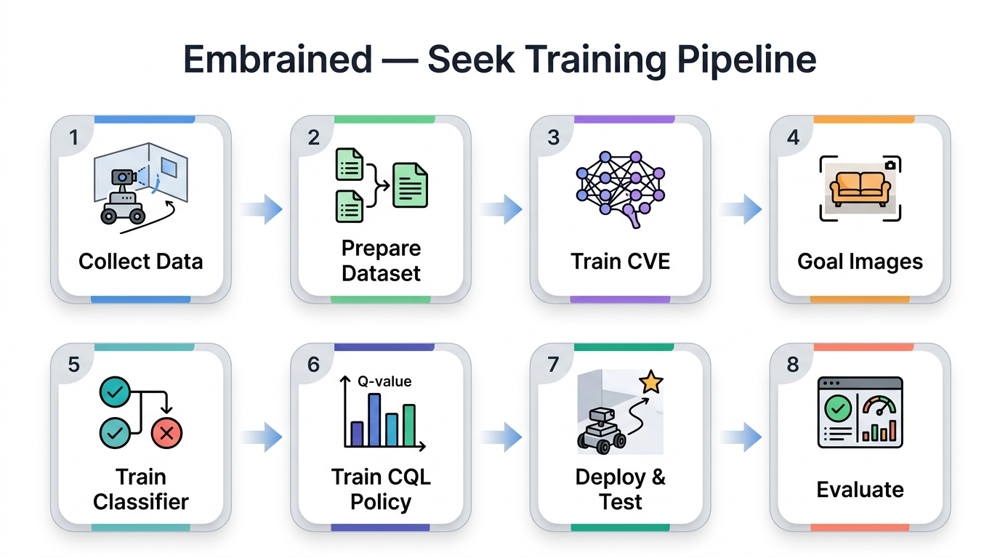

# Embrained

**Train and deploy neural navigation agents on low-cost robots — locally, privately, on your own PC.**

Embrained offloads all heavy compute from the robot to your local GPU over WiFi. You collect real-world data by driving the robot around your home, train vision encoders and navigation policies on your machine, then deploy them back to the robot for autonomous goal-directed navigation. No cloud. No expensive onboard hardware.

For more information, visit the [Embrained website](https://embrained.ai). If you wish to get a Plexus robot, you can purchase it on the [Plexus robot Shopify page](https://admin.shopify.com/store/embrained-llc/products/10581913174325).





## Quick Start

### 1. Install

**Step 1.** Install [Node.js](https://nodejs.org/) (required for the frontend dashboard).

**Step 2.** Clone the repository:

```bash
git clone https://github.com/Embrained/embrained-app.git
cd embrained-app
```

### 2. Connect to Robot

1. Power on your Plexus robot.
2. Wait for the tally light to blink at 1 Hz, indicating it is ready to connect.
3. Connect your computer to the robot's WiFi access point (SSID typically looks like `Plexus_XXXX`).
4. The tally light will change to steady ON when your computer has successfully connected to the robot.

### 3. Launch

Run the setup script to create an isolated virtual environment with Python 3.12, PyTorch, and other dependencies, then launch the app:

- **Windows:** run `setup.bat`, then run `start.bat`
- **Mac/Linux:** run `./setup.sh`, then run `./start.sh`

Open [http://localhost:8080](http://localhost:8080) to access the dashboard for teleoperation, live telemetry, and autonomy control.

---

## Training Pipeline



All training scripts live in the `seek/` folder and should be run from the `embrained-app` root directory. Activate your virtual environment first (`venv\Scripts\activate.bat` on Windows, `source venv/bin/activate` on Mac/Linux).

The pipeline trains a goal-seeking reflex: given a set of example images showing what "at the goal" looks like (e.g. close-ups of your sofa), the robot learns to navigate there from anywhere in the environment.

### Step 1 — Collect Exploration Data

Use the dashboard to drive the robot and record training data:

1. Drive the robot around using **manual control** (keyboard/gamepad) or start an **autonomous exploration controller** (Markov) to explore automatically.
2. Press **REC** to begin recording. The robot saves camera frames, motor commands, and sensor readings as it moves.
3. Press **REC** again to stop. Each session is saved to `data/markov_<timestamp>/`.

Record several sessions covering your environment from different starting positions. More diverse data produces better navigation.

### Step 2 — Prepare Dataset

Consolidate all recorded sessions into a single pooled transition file:

```bash
python seek/prepare_dataset.py
```

This scans every `data/markov_*/` folder, extracts image–action–image transitions, and writes `data/all_transitions.json`.

### Step 3 — Train the CVE

Train the Contrastive Visuomotor Encoder (CVE), a general-purpose vision backbone that compresses 64×64 camera frames into 32-dimensional latent state vectors:

```bash
python seek/train_cve.py
```

The CVE is goal-agnostic — it learns the structure of your environment from exploration data alone. You only need to train it once; the same encoder is reused for every goal you define later. The trained checkpoint is saved to `data/cve_32d_<timestamp>.pth`.

### Step 4 — Create Goal Images

Create a subfolder inside `data/` named after your goal and fill it with approximately 100 close-up photographs showing what "at the goal" looks like from the robot's perspective:

```bash
mkdir data/sofa
# Add ~100 close-up images of the sofa to data/sofa/
```

These images should show the target object filling most of the frame, as the robot would see it when it has successfully arrived. You can pull frames from your recorded sessions (`data/markov_*/images/`) or take new photographs manually.

Repeat this step for each goal you want the robot to seek (e.g. `data/tv/`, `data/kitchen/`).

### Step 5 — Train the Goal Classifier

Train a binary CNN that distinguishes "at the goal" from "not at the goal." This classifier is used only during CQL training to shape the reward signal — it is discarded at inference time.

```bash
python seek/train_classifier.py sofa
```

Replace `sofa` with your goal folder name. The trained classifier is saved to `data/sofa_classifier.pth`. Training curves and validation metrics are saved to `images/`.

### Step 6 — Train the CQL Policy

Train the Conservative Q-Learning (CQL) navigation policy. This is the model that actually runs on the robot — a small MLP that maps 32-dim CVE latent vectors to motor commands:

```bash
python seek/train_seek_cql.py sofa
```

The script automatically loads the latest CVE checkpoint and the goal classifier, then trains an offline RL policy using classifier-shaped rewards. The output model is saved to `data/cve_32d_<timestamp>-sofa_seek_cql_model.pth`.

### Step 7 — Deploy and Test

1. Power on your Plexus robot and verify its WiFi connection.
2. Launch the app (`start.bat` or `./start.sh`).
3. Open the **Autonomy Panel** in the dashboard.
4. Select your seek model (e.g. `SOFA-SEEK CQL`) from the model dropdown.
5. Click **Start Autonomy**.

The robot will navigate toward the goal in real time. The latent space panel shows the robot's current position and the goal target marker. To test robustness, manually pick up and reposition the robot at random locations — it should re-orient and drive back to the goal each time.

### Step 8 — Evaluate Performance (Offline)

After running a displacement trial session (repeatedly moving the robot to random positions and letting it navigate back), evaluate the recorded data offline:

```bash
python seek/evaluate_navigation_trials.py markov_<session_name> --goal sofa
```

The evaluator automatically segments the recording into individual trials by detecting sudden jumps in the latent embedding (manual displacement events), then scores each trial on whether the robot reached the goal (classifier confidence > 0.85 at the final frame with an intentional stop action).

Output:
- `data/trial_results.json` — per-trial metrics (steps to goal, final confidence, success/fail)
- `images/trial_results.png` — summary plot with step distributions and success rate

---

## Adding More Goals

The CVE backbone is shared across all goals. To train a new goal, you only need to repeat Steps 4–6:

```bash
mkdir data/tv
# Add ~100 close-up TV images to data/tv/
python seek/train_classifier.py tv
python seek/train_seek_cql.py tv
```

Each goal produces its own classifier and CQL policy. You can switch between them at runtime from the model dropdown in the dashboard.

---

## Optional Setup

**CUDA (GPU acceleration):**
The default install is CPU-only. For faster training with an NVIDIA GPU:

```bash
pip install torch torchvision torchaudio --index-url https://download.pytorch.org/whl/cu121
```

---

## Community

Share your trained weights, datasets, and demo videos on our [Discord](https://discord.com/channels/1487132795833684228/1487132796920004640). Contributed model weights feed into a federated **Model Soup** — enabling generalization across diverse home environments without sharing raw data.

## License

- **Software** — [GPLv3](LICENSE). Open to audit, modify, and contribute.
- **Your locally-trained weights** — 100% yours, no restrictions.
- **Pre-trained / aggregated weights** distributed by Embrained — governed by the Embrained Open-Weights EULA (non-commercial use permitted; commercial use requires a license). See [LICENSE](LICENSE) for full terms.
